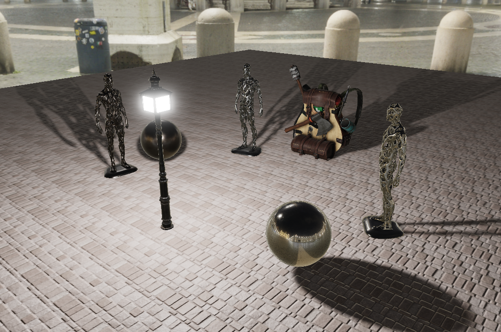

Opengl 3d scene

This is a project for the SAE institute:

The goal was to do a scene and to add a maximum of rendering effects to it, this is how the final scene looks like:

You can also see the blogpost about it: https://cochta.github.io/scene.html

Download the release to see the scene and navigate arround objects