<meta charset="utf-8" emacsmode="-*- markdown -*-">
<link rel="stylesheet" href="https://casual-effects.com/markdeep/latest/slate.css?">

**OpenGl 3d scene blogpost**
Version 1.0

This blog post tracks the evolution of my OpenGl 3d scene

About
==============================================================

This project is a small 3d scene developed for the SAE Institute.

Content
--------------------------------------------------------------

- Skybox
- Face culling
- 2d texture and 3d model loading
- Physically Based Bloom (Post proccessing)
- Deferred shading
- Screen Space Ambient Occlusion (SSAO)
- Shadow mapping
- Physically Based Rendering (PBR)
- Image Based Lighting (IBL)

Texture loading & Skybox
==============================================================

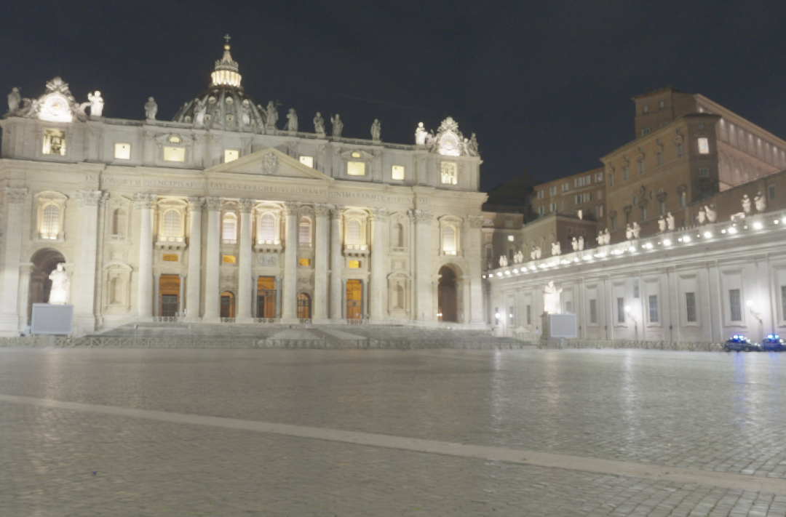

To load this skybox texture found here: https://polyhaven.com/a/st_peters_square_night,
I used the stb_image library found here https://github.com/nothings/stb

~~~~~~~~~~~~~~~~~~~~~~~~~~~~~~~~~~~~~~~~~~~~~~ C++
int width, height, nr_channels;
unsigned char *data = stbi_load("path to file", &width, &height, &nr_channels, 0);
~~~~~~~~~~~~~~~~~~~~~~~~~~~~~~~~~~~~~~~~~~~~~~

Then i transformed the hdri file into 6 squares using a frame buffer

~~~~~~~~~~~~~~~~~~~~~~~~~~~~~~~~~~~~~~~~~~~~~~ C++
for (unsigned int i = 0; i < 6; ++i) {
    cubemap_pipe_.SetMat4("view", captureViews[i]);
    glFramebufferTexture2D(GL_FRAMEBUFFER, GL_COLOR_ATTACHMENT0,
                           GL_TEXTURE_CUBE_MAP_POSITIVE_X + i, env_cubemap_, 0);
    glClear(GL_COLOR_BUFFER_BIT | GL_DEPTH_BUFFER_BIT);

    cube_.Draw();
  }
~~~~~~~~~~~~~~~~~~~~~~~~~~~~~~~~~~~~~~~~~~~~~~

and renderered them as a skybox.

~~~~~~~~~~~~~~~~~~~~~~~~~~~~~~~~~~~~~~~~~~~~~~ C++
background_pipe_.Bind();
background_pipe_.SetMat4("view", view);
background_pipe_.SetMat4("projection", projection);
glActiveTexture(GL_TEXTURE0);
glBindTexture(GL_TEXTURE_CUBE_MAP, env_cubemap_);

cube_.Draw();
~~~~~~~~~~~~~~~~~~~~~~~~~~~~~~~~~~~~~~~~~~~~~~

Model loading (.obj)
==============================================================

To load models from .obj file, I used the assimp library found here: https://github.com/assimp/assimp

~~~~~~~~~~~~~~~~~~~~~~~~~~~~~~~~~~~~~~~~~~~~~~ C++
// for each mesh in the model, I store the data

for (unsigned int i = 0; i < mesh->mNumVertices; i++) {

    my_mesh.vertices_.push_back(mesh->mVertices[i].x);
    my_mesh.vertices_.push_back(mesh->mVertices[i].y);
    my_mesh.vertices_.push_back(mesh->mVertices[i].z);

    my_mesh.normals_.push_back(mesh->mNormals[i].x);
    my_mesh.normals_.push_back(mesh->mNormals[i].y);
    my_mesh.normals_.push_back(mesh->mNormals[i].z);

    my_mesh.tangents_.push_back(mesh->mTangents[i].x);
    my_mesh.tangents_.push_back(mesh->mTangents[i].y);
    my_mesh.tangents_.push_back(mesh->mTangents[i].z);

    my_mesh.bitangents_.push_back(mesh->mBitangents[i].x);
    my_mesh.bitangents_.push_back(mesh->mBitangents[i].y);
    my_mesh.bitangents_.push_back(mesh->mBitangents[i].z);

    // If the mesh contains texture coordinates, stores it.
    if (mesh->mTextureCoords[0]) {
      my_mesh.tex_coord_.push_back(mesh->mTextureCoords[0][i].x);
      my_mesh.tex_coord_.push_back(mesh->mTextureCoords[0][i].y);
    } else {
      my_mesh.tex_coord_.push_back(0);
      my_mesh.tex_coord_.push_back(0);
    }
  }

  // Process indices (each faces has a number of indices).
  for (unsigned int i = 0; i < mesh->mNumFaces; i++) {
    aiFace face = mesh->mFaces[i];

    for (unsigned int j = 0; j < face.mNumIndices; j++) {
      my_mesh.indices_.push_back(face.mIndices[j]);
    }
  }
~~~~~~~~~~~~~~~~~~~~~~~~~~~~~~~~~~~~~~~~~~~~~~

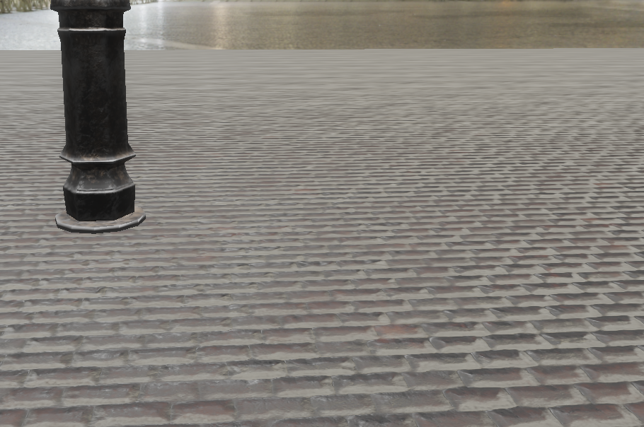

Face culling
==============================================================

To not draw unnecessary things, i setted up front face culling for the skybox and back face culling for the others objects i draw.

~~~~~~~~~~~~~~~~~~~~~~~~~~~~~~~~~~~~~~~~~~~~~~ C++
glEnable(GL_CULL_FACE);
glCullFace(GL_FRONT); // for the skybox

glCullFace(GL_BACK); // for the rest
~~~~~~~~~~~~~~~~~~~~~~~~~~~~~~~~~~~~~~~~~~~~~~

Here are 2 views with the camera inside the floor:

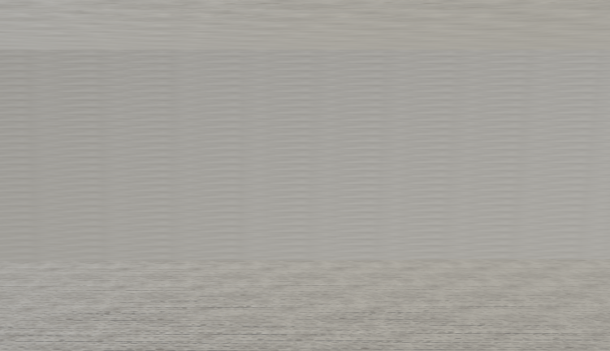 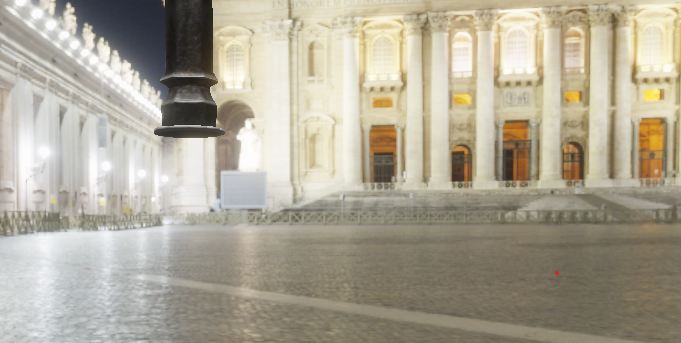

Physically Based Bloom 
==============================================================

For my street lamp i wanted it to be the main light source of the scene and so i added a physically based bloom in post processing, 
the bloom also works on the skybox "light sources".

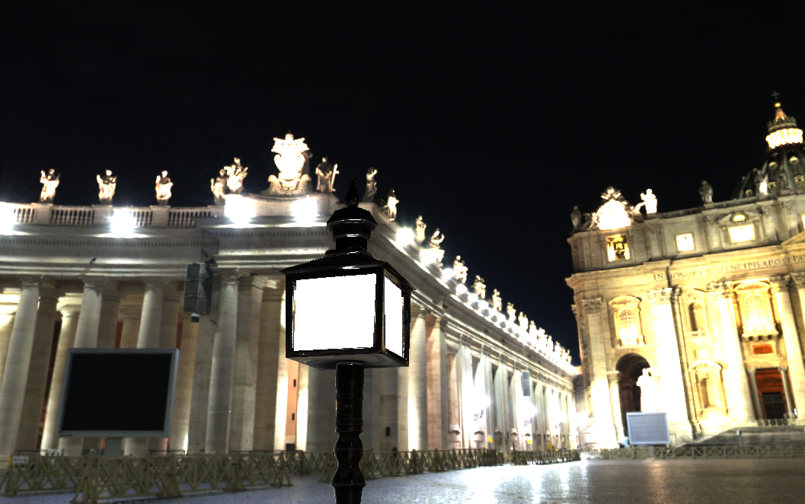 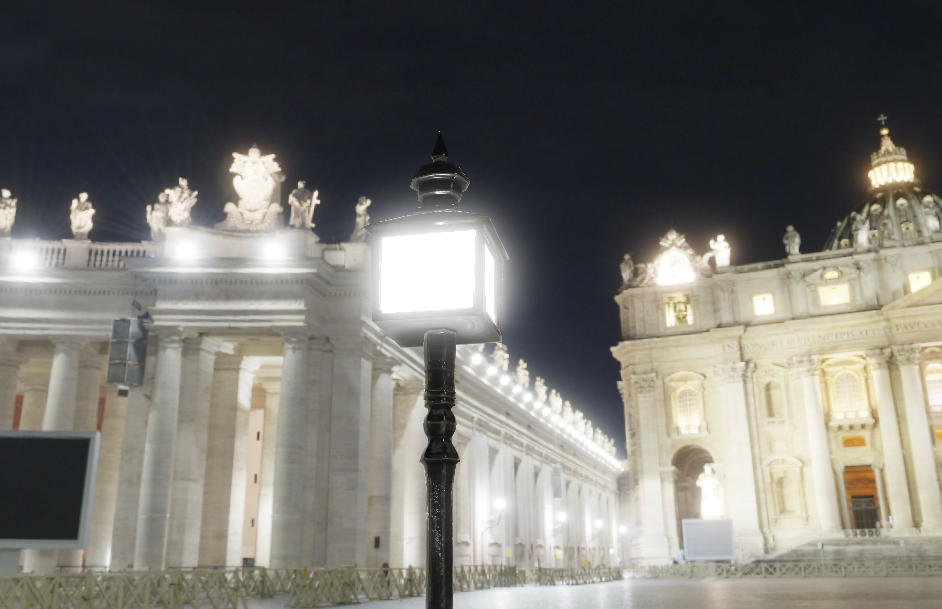

Basically, i apply bloom to all values that are superior to 1, it works for the skybox because it is in HDR (High Dynamic Range)

To do so, i do the calculations inside the fragment shader, i also do the gamma corection here.

~~~~~~~~~~~~~~~~~~~~~~~~~~~~~~~~~~~~~~~~~~~~~~ glsl
void main()
{             
    const float gamma = 2.2;
    vec3 hdrColor = texture(scene, texCoords).rgb;
    vec3 bloomColor = texture(bloomBlur, texCoords).rgb;
    vec3 mixed_color = mix(hdrColor, bloomColor, bloomStrength); // linear interpolation;

    if(hdr)
    {
        // exposure
        vec3 result = vec3(1.0) - exp(-mixed_color * exposure);
        // also gamma correction       
        result = pow(result, vec3(1.0 / gamma));
        fragColor = vec4(result, 1.0);
    }
    else
    {
        vec3 result = pow(mixed_color, vec3(1.0 / gamma));
        fragColor = vec4(result, 1.0);
    }
}
~~~~~~~~~~~~~~~~~~~~~~~~~~~~~~~~~~~~~~~~~~~~~~

Deferred shading
==============================================================

Firstly i draw all my objects inside a G buffer, i use all channels to store the data.

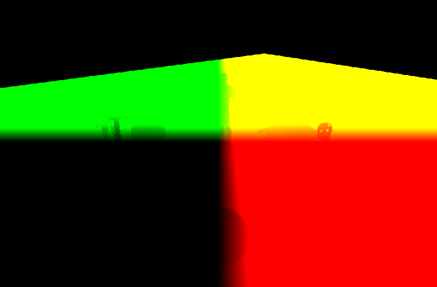 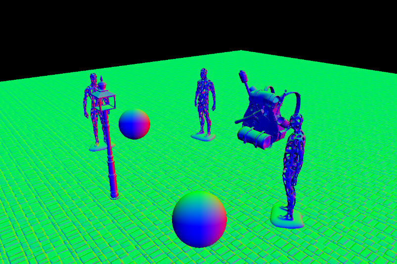
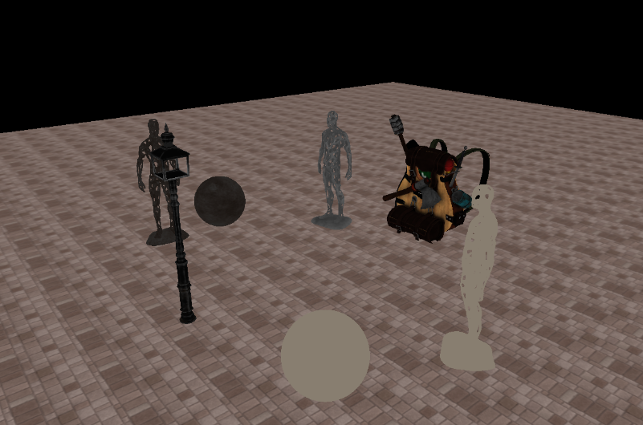

Screen Space Ambient Occlusion (SSAO)
==============================================================

Then i generate a texture to add some small shadows to the curvitude of the objects.

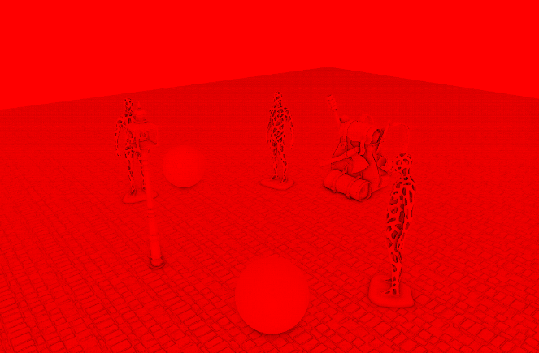

then in the fragment shader i just multiply the basic ao by the ssao.

~~~~~~~~~~~~~~~~~~~~~~~~~~~~~~~~~~~~~~~~~~~~~~ glsl
float ssao = texture(ssao_tex, texCoords).r;
ao *= ssao;
~~~~~~~~~~~~~~~~~~~~~~~~~~~~~~~~~~~~~~~~~~~~~~

Shadow mapping
==============================================================

Instead of a classic directional light i decided to have a point light, to have good shadows i had to create a shadow cubemap to draw the scene 6 times, 1 for each direction of the light.

Here are 3 of the textures so you can see how it looks like, (it is reversed, it is normal)

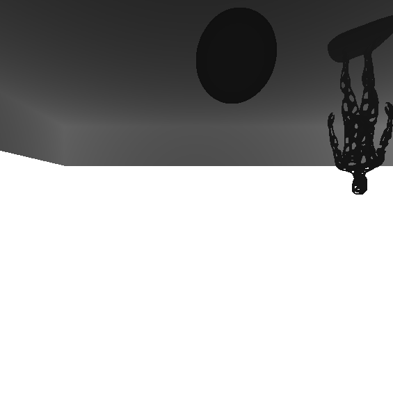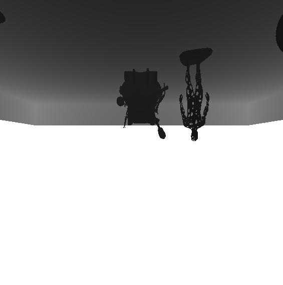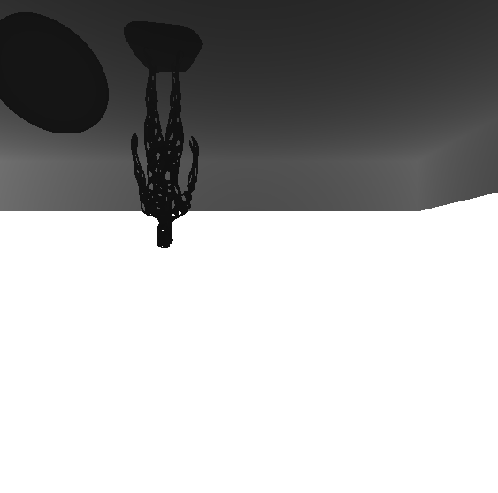

PBR & IBL
==============================================================

My shader is responsible of calculating realistic lighting based on phycal properties of materials, incorporating techniques like Image-Based Lighting (IBL), it also applies Screen Space Ambient Occlusion (SSAO), and shadows.

## Material Properties:
The shader fetches material properties such as albedo, metallic, roughness, and ambient occlusion from textures. These properties define how light interacts with the surface.

## Lighting Calculation:
The shader computes the lighting contribution from a point light source. It calculates the Cook-Torrance BRDF (Bidirectional Reflectance Distribution Function), which describes how light reflects off surfaces. This involves intricate calculations considering surface normal, view direction, light direction, and roughness.

## Shadow Calculation:
For each fragment, the shader reads the shadow map to determine if it's in shadow. In other words, it samples the depth texture from the light's perspective and compares it with the fragment's depth.

## Ambient Lighting:
This shader uses IBL, to simulate ambient light from the environment. It samples an irradiance map and a pre-filtered environment map to compute indirect lighting.

## Final Color Calculation:
The shader combines ambient lighting, direct lighting, and shadowing to compute the final color of the fragment. It also handles a brightness threshold to determine if a fragment should emit bloom effects.

Thank you for reading so far !!!
==============================================================
I honestly hope, you enjoyed it :)

See Also
==============================================================

[My GitHub page](https://github.com/Cochta).

<!-- Markdeep: -->

